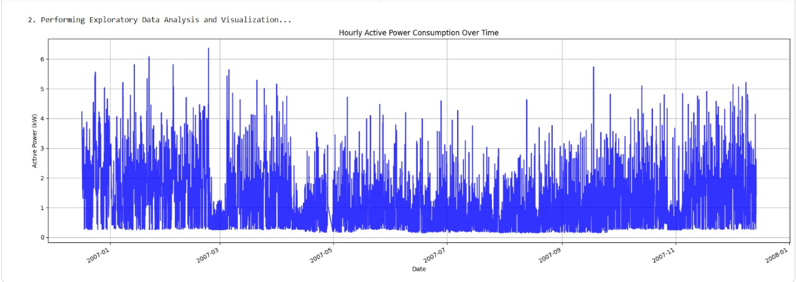

# Smart Grid Energy Demand Forecasting ⚡📊

A high-fidelity Short-Term Load Forecasting (STLF) system designed to predict hourly household electricity demand. This project leverages advanced machine learning (XGBoost) and deep learning (LSTM) techniques to navigate high-volatility consumption patterns, aiding in efficient grid load balancing and smart meter operations.

## 📖 Project Overview

The energy sector is transitioning toward digital, data-driven infrastructures. Accurate forecasting at the household level is critical for:
* **Grid Stability:** Preventing outages caused by underestimating demand.
* **Cost Efficiency:** Reducing energy wastage from overestimation.
* **Consumer Planning:** Enabling better usage of Time-of-Use (ToU) tariffs.

This project utilizes the "Individual Household Electric Power Consumption" dataset to build models that capture complex non-linear patterns, seasonality, and long-term dependencies in high-resolution smart meter data.

## 🏗️ Architecture & Methodology

### Data Preprocessing
* **Resampling:** Converted minute-level sampling to hourly frequency to reduce noise.
* **Cleaning:** Handled missing values and parsed dates into a Datetime index.
* **Feature Engineering:**
    * **Temporal Features:** Hour, DayOfWeek, Month, Year.
    * **Cyclical Encoding:** Sine/Cosine transformations for time variables.
    * **Lag Features:** Created 24h (daily) and 168h (weekly) lags to capture autocorrelation.
    * **Rolling Statistics:** 6-hour rolling mean and standard deviation for trend analysis.

### Models Implemented
1.  **XGBoost (Extreme Gradient Boosting):**
    * Optimized using **Optuna** for Bayesian Hyperparameter Search.
    * Configured with a "slow learning" approach (low learning rate, high estimators) to prevent overfitting.
2.  **LSTM (Long Short-Term Memory):**
    * **Stacked Architecture:** 2-layer network (100 units $\to$ 50 units) to extract hierarchical temporal patterns.
    * **Bidirectional LSTM:** Tested for capturing future context (backward pass).
    * **Regularization:** Dropout (0.2) to prevent co-adaptation.

---

## 📸 Exploratory Data Analysis (EDA)

*Below are insights derived from the historical consumption data.*

### 1. Long-Term Trends
Visualizing active power consumption (2006-2010) reveals annual seasonality and irregularities.

### 2. Seasonal Decomposition
Decomposing the time series isolates the recurring seasonal signal from the underlying trend and noise.

### 3. Monthly & Daily Patterns
Consumption rises significantly during colder months and shows distinct variations between weekdays and weekends.

### 4. Hourly Cycles
Consistent daily cycles reflect typical household activity routines.

---

## 🏆 Model Performance & Results

We benchmarked the models using **RMSE** (Root Mean Squared Error) and **MAE** (Mean Absolute Error) on a hold-out test set (final 3 months).

| Model | Configuration | RMSE (kW) | MAE (kW) |
| :--- | :--- | :--- | :--- |
| **LSTM (Selected)** | **2-Layer Stacked (1hr lag)** | **0.5522** | **0.3788** |
| LSTM (Bidirectional) | 2-Layer Bidirectional | 0.5539 | 0.3686 |
| XGBoost | Optimized (966 estimators) | 0.5784 | 0.4155 |

**Key Finding:** The Stacked LSTM model achieved the best balance of accuracy and computational efficiency, outperforming the ensemble-based XGBoost method by effectively learning long-term temporal dependencies.

